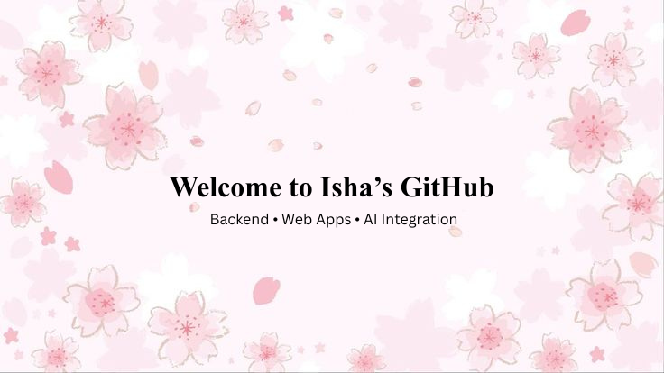

       

 

    

       

       
<h2 align="left" style="margin: 6px 0 14px;">🌐 Connect with me</h2>

          
 
            &nbsp;&nbsp;
            
            &nbsp;&nbsp;
            
        

       

       
<h2 align="left" style="margin: 6px 0 10px;">💫 About Me</h2>

            I’m a passionate Software Developer focused on building <b>modern</b> and <b>scalable</b> web applications.
            I love solving real-world problems through <b>clean code</b>, solid backend architecture, and continuous
            learning.
        

       

       

        
    

        

       
<h2 align="left" style="margin: 6px 0 14px;">📊 Statistics</h2>

            <table width="100%">
                <tr>
                    <td width="50%" align="center">
                        
                    </td>
                    <td width="50%" align="center">
                        
                    </td>
                </tr>
            </table>
        

       

       

            
        

## 🏆 Trophies

       

       

            
        

